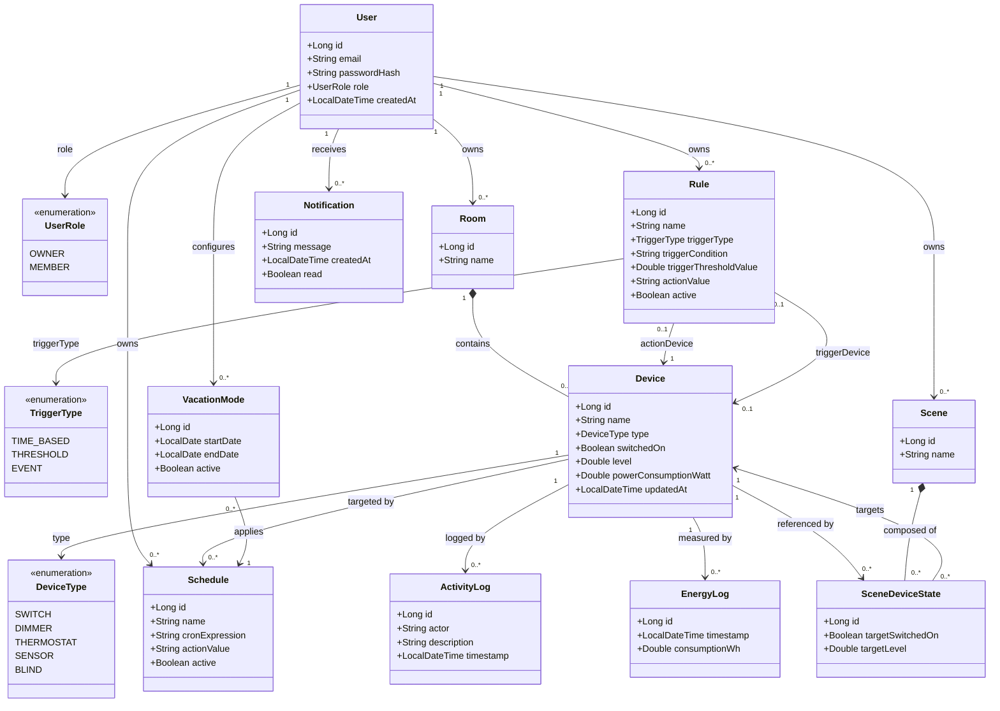

# SmartHome Orchestrator — Domänenmodell

## Überblick

Dieses Dokument beschreibt das fachliche Domänenmodell sowie die vollständige Klassenstruktur des Backends.
Neben den zentralen Entitäten werden auch API-, Service-, Integrations- und Infrastrukturklassen paketweise erläutert.

## Paketstruktur

- `at.jku.se`: Initialisierung und Initialdaten
- `at.jku.se.dto.request`: Eingabemodelle für REST-Endpunkte
- `at.jku.se.dto.response`: Ausgabemodelle für REST-Endpunkte
- `at.jku.se.entity`: Persistente Domänenobjekte
- `at.jku.se.entity.enums`: Fachliche Enumerationen
- `at.jku.se.mapper`: Mapping zwischen Entity und DTO
- `at.jku.se.repository`: Datenzugriff über Panache
- `at.jku.se.resource`: REST-API-Endpunkte
- `at.jku.se.service`: Geschäftslogik und Regeln
- `at.jku.se.iot`: IoT-Integrationsschicht
- `at.jku.se.websocket`: Echtzeitkommunikation

## Entitätsbeschreibungen

| Entität | Tabelle | Beschreibung |
|---|---|---|
| `User` | `users` | Registrierter Benutzer mit Rolle OWNER oder MEMBER (FR-01, FR-13) |
| `Room` | `rooms` | Benannte Gruppe von Geräten eines Benutzers (FR-03) |
| `Device` | `devices` | Virtuelles Smart-Home-Gerät mit typisiertem Zustand (FR-04, FR-07) |
| `Schedule` | `schedules` | Wiederkehrende zeitbasierte Geräteaktion per Cron-Ausdruck (FR-09) |
| `Rule` | `rules` | IF-THEN-Automatisierung mit Zeit-, Schwellwert- oder Ereignis-Trigger (FR-10, FR-11) |
| `Scene` | `scenes` | Benannte Menge von Gerätezielzuständen zur gemeinsamen Aktivierung (FR-17) |
| `SceneDeviceState` | `scene_device_states` | Zielzustand eines Geräts innerhalb einer Szene |
| `ActivityLog` | `activity_logs` | Unveränderbares Audit-Protokoll jeder Gerätezustandsänderung (FR-08) |
| `EnergyLog` | `energy_logs` | Periodischer Energieverbrauchseintrag pro Gerät (FR-14) |
| `Notification` | `notifications` | In-App-Benachrichtigung bei Regelausführung oder Szenenaktivierung (FR-12) |
| `VacationMode` | `vacation_modes` | Ersatzzeitplan für einen definierten Urlaubszeitraum (FR-21) |

## Zentrale Geschäftsregeln

- Ein **Room** wird zusammen mit allen zugehörigen **Device**-Einträgen gelöscht (Cascade).
- Beim Löschen eines **Device** werden auch zugehörige **Schedule**, **ActivityLog**, **EnergyLog** und **SceneDeviceState** gelöscht.
- Beim Löschen eines **Schedule** werden referenzierende **VacationMode**-Einträge mitgelöscht.
- Nur Benutzer mit Rolle **OWNER** dürfen Mitglieder einladen oder entziehen (FR-20).
- Zwei aktive **Schedule** für dasselbe **Device** mit identischem Cron-Ausdruck gelten als Konflikt (FR-15) und werden mit HTTP 409 abgelehnt.
- Bei **VacationMode** darf `endDate` nicht vor `startDate` liegen.
- Passwörter werden als **BCrypt**-Hash gespeichert, niemals im Klartext (NFR-02).

## Vollständige Klassenübersicht

### Initialisierung

| Klasse | Beschreibung |
|---|---|
| `StartupDataLoader` | Initialisiert beim Start Test- und Beispieldaten für Benutzer, Räume, Geräte, Regeln und Logs. |

### DTOs — Anfrage

| Klasse | Beschreibung |
|---|---|
| `DeviceCreateRequest` | Eingabedaten zum Anlegen eines neuen Geräts. |
| `DeviceRenameRequest` | Eingabedaten zum Umbenennen eines Geräts. |
| `DeviceStateRequest` | Eingabedaten zur manuellen Zustandsänderung eines Geräts. |
| `EnergyLogRequest` | Eingabedaten zum Erfassen von Energieverbrauchswerten. |
| `InviteRequest` | Eingabedaten zum Einladen eines Mitglieds durch einen OWNER. |
| `RoomRequest` | Eingabedaten zum Anlegen oder Aktualisieren eines Raums. |
| `RuleRequest` | Eingabedaten zum Erstellen oder Aktualisieren einer Automatisierungsregel. |
| `SceneDeviceStateRequest` | Eingabedaten für den Zielzustand eines Geräts innerhalb einer Szene. |
| `SceneRequest` | Eingabedaten zum Anlegen oder Bearbeiten einer Szene. |
| `ScheduleRequest` | Eingabedaten zum Anlegen oder Aktualisieren eines Zeitplans. |
| `UserLoginRequest` | Eingabedaten für den Login (E-Mail und Passwort). |
| `UserRegisterRequest` | Eingabedaten für die Benutzerregistrierung. |
| `VacationModeRequest` | Eingabedaten für den Urlaubsmodus und dessen Zeitraum. |

### DTOs — Antwort

| Klasse | Beschreibung |
|---|---|
| `ActivityLogResponse` | Ausgabemodell für Aktivitätsprotokolle. |
| `ConflictResponse` | Ausgabemodell für erkannte Planungskonflikte. |
| `DeviceResponse` | Ausgabemodell für Gerätedaten und Gerätezustand. |
| `EnergyDashboardResponse` | Aggregierte Ausgabedaten für das Energie-Dashboard. |
| `EnergyLogResponse` | Ausgabemodell für einzelne Energieverbrauchseinträge. |
| `NotificationResponse` | Ausgabemodell für In-App-Benachrichtigungen. |
| `RoomResponse` | Ausgabemodell für Raumdaten. |
| `RuleResponse` | Ausgabemodell für Automatisierungsregeln. |
| `SceneDeviceStateResponse` | Ausgabemodell für Gerätezielzustände in Szenen. |
| `SceneResponse` | Ausgabemodell für Szenen inklusive enthaltenen Zielzuständen. |
| `ScheduleResponse` | Ausgabemodell für Zeitpläne. |
| `UserResponse` | Ausgabemodell für Benutzerdaten ohne Passwort-Hash. |
| `VacationModeResponse` | Ausgabemodell für Urlaubsmodus-Konfigurationen. |

### Entitäten

| Klasse | Beschreibung |
|---|---|
| `ActivityLog` | Persistiert Änderungen und Aktionen an Geräten als Audit-Log. |
| `Device` | Persistiert Smart-Home-Geräte mit Typ, Schaltzustand und Messwerten. |
| `EnergyLog` | Persistiert zeitbezogene Energieverbrauchswerte pro Gerät. |
| `Notification` | Persistiert Benachrichtigungen für Benutzer. |
| `Room` | Persistiert Räume als Gruppierung für Geräte. |
| `Rule` | Persistiert IF-THEN-Regeln für die Automatisierung. |
| `Scene` | Persistiert benannte Szenen mit mehreren Gerätezielzuständen. |
| `SceneDeviceState` | Persistiert den Zielzustand eines Geräts innerhalb einer Szene. |
| `Schedule` | Persistiert zeitbasierte Aktionen auf Basis von Cron-Ausdrücken. |
| `User` | Persistiert Benutzerkonto, Rolle und Sicherheitsinformationen. |
| `VacationMode` | Persistiert Urlaubsmodus-Zeiträume und zugewiesene Ersatzzeitpläne. |

### Enumerationen

| Klasse | Beschreibung |
|---|---|
| `DeviceType` | Definiert unterstützte Gerätetypen (z. B. SWITCH, DIMMER, THERMOSTAT). |
| `TriggerType` | Definiert Auslösertypen für Regeln (TIME_BASED, THRESHOLD, EVENT). |
| `UserRole` | Definiert Rollenmodell mit OWNER und MEMBER. |

### Mapper

| Klasse | Beschreibung |
|---|---|
| `ActivityLogMapper` | Wandelt `ActivityLog` in `ActivityLogResponse` um. |
| `DeviceMapper` | Wandelt `Device` in `DeviceResponse` um. |
| `EnergyLogMapper` | Wandelt `EnergyLog` in `EnergyLogResponse` um. |
| `NotificationMapper` | Wandelt `Notification` in `NotificationResponse` um. |
| `RoomMapper` | Wandelt `Room` in `RoomResponse` um. |
| `RuleMapper` | Wandelt `Rule` in `RuleResponse` um. |
| `SceneMapper` | Wandelt `Scene` in `SceneResponse` um. |
| `ScheduleMapper` | Wandelt `Schedule` in `ScheduleResponse` um. |
| `UserMapper` | Wandelt `User` in `UserResponse` um. |
| `VacationModeMapper` | Wandelt `VacationMode` in `VacationModeResponse` um. |

### Repositories

| Klasse | Beschreibung |
|---|---|
| `ActivityLogRepository` | Panache-Repository für Aktivitätslog-Abfragen und Persistenz. |
| `DeviceRepository` | Panache-Repository für Geräteabfragen und Gerätepersistenz. |
| `EnergyLogRepository` | Panache-Repository für Energieprotokolle und Auswertungen. |
| `NotificationRepository` | Panache-Repository für Benachrichtigungen pro Benutzer. |
| `RoomRepository` | Panache-Repository für Räume und zugehörige Abfragen. |
| `RuleRepository` | Panache-Repository für Regeln und Filter nach Benutzer/Gerät. |
| `SceneRepository` | Panache-Repository für Szenen und zugehörige Abfragen. |
| `ScheduleRepository` | Panache-Repository für Zeitpläne und Konfliktabfragen. |
| `UserRepository` | Panache-Repository für Benutzer, inklusive Suche nach E-Mail. |
| `VacationModeRepository` | Panache-Repository für Urlaubsmodus-Datensätze. |

### REST-Ressourcen

| Klasse | Beschreibung |
|---|---|
| `ActivityLogResource` | REST-Endpunkte zum Abrufen von Aktivitätsprotokollen und CSV-Export. |
| `ConflictResource` | REST-Endpunkte zur Prüfung von Planungs- und Regelkonflikten. |
| `DeviceResource` | REST-Endpunkte für Geräteverwaltung und Gerätesteuerung. |
| `EnergyResource` | REST-Endpunkte für Energieverbrauchsdaten und Dashboard-Werte. |
| `IoTResource` | REST-Endpunkte für IoT-bezogene Aktionen und Integrationszugriffe. |
| `NotificationResource` | REST-Endpunkte für Benachrichtigungen eines Benutzers. |
| `RoomResource` | REST-Endpunkte für Raum-CRUD-Operationen. |
| `RuleResource` | REST-Endpunkte für Regel-CRUD und Regelaktivierung. |
| `SceneResource` | REST-Endpunkte für Szenen-CRUD und Szenenaktivierung. |
| `ScheduleResource` | REST-Endpunkte für Zeitplan-CRUD mit Konflikterkennung. |
| `UserResource` | REST-Endpunkte für Registrierung, Login und Mitgliederverwaltung. |
| `VacationModeResource` | REST-Endpunkte für Urlaubsmodus-CRUD und Statusverwaltung. |

### Services

| Klasse | Beschreibung |
|---|---|
| `ConflictDetectionService` | Enthält Regeln zur Erkennung von Konflikten in Zeitplänen und Automatisierungen. |
| `RuleEngineService` | Führt Regeln aus, bewertet Triggerbedingungen und löst Geräteaktionen aus. |

### IoT-Integration

| Klasse | Beschreibung |
|---|---|
| `DeviceCommand` | Modelliert auszuführende IoT-Befehle für Geräteaktionen. |
| `DeviceEvent` | Modelliert eingehende IoT-Ereignisse aus externen Quellen. |
| `IoTException` | Fachspezifische Exception für Fehler in der IoT-Integrationsschicht. |
| `IoTIntegrationService` | Koordiniert IoT-Kommunikation zwischen Domäne und Protokolladaptern. |
| `IoTProtocol` | Abstraktion für unterstützte IoT-Protokollimplementierungen. |
| `IoTProtocolFactory` | Erstellt und liefert passende Protokolladapter zur Laufzeit. |
| `MockProtocolAdapter` | Simulierter Adapter für lokale Entwicklung und Tests. |
| `MqttProtocolAdapter` | MQTT-Adapter für echte oder emulierte Gerätekommunikation. |

### WebSocket

| Klasse | Beschreibung |
|---|---|
| `DeviceEventBroadcaster` | Verteilt Geräteereignisse an verbundene WebSocket-Clients. |
| `DeviceStateSocket` | WebSocket-Endpunkt für Echtzeit-Updates von Gerätezuständen. |
