# Benutzerdokumentation

## Zielgruppe

Die Anwendung richtet sich an Personen, die ein Smart Home zentral verwalten und automatisieren möchten.

Primäre Zielgruppen sind:

- Haushaltsverantwortliche (Owner), die Räume, Geräte, Regeln, Zeitpläne, Szenen und Mitglieder verwalten.
- Haushaltsmitglieder (Member), die freigegebene Geräte bedienen und den aktuellen Zustand des Zuhauses einsehen.
- Technikaffine Nutzerinnen und Nutzer, die Automatisierungen wie IF-THEN-Regeln, Zeitpläne und Urlaubsmodus aktiv nutzen möchten.

Die Anwendung ist besonders geeignet für kleine bis mittlere Haushalte, in denen mehrere Personen gemeinsam auf ein Smart-Home-System zugreifen und dabei eine klare Rollenverteilung benötigen.

## Voraussetzungen

Bevor das Projekt gestartet werden kann, muessen folgende Tools installiert sein:

- [ ] **Docker** (inkl. Docker Compose) -- [docker.com](https://www.docker.com/)
- [ ] **Git** -- zum Klonen des Repositories

Fuer die lokale Entwicklung zusaetzlich:

- [ ] **JDK 21** -- z.B. Eclipse Temurin oder Oracle JDK
- [ ] **Maven 3.9+** -- oder den enthaltenen Maven Wrapper (`./mvnw`) verwenden
- [ ] **Node.js 22+** und **npm** -- fuer das Frontend

## Installation und Start

Es gibt zwei gleichwertige Optionen zum Starten der Anwendung.

### Option A: Nur mit Docker Compose (empfohlen für schnellen Start)

1. Projekt im Repository-Root öffnen.
2. Docker Desktop starten.
3. Mit docker compose up --build alle Services starten.

Hinweis: In Docker Compose werden Frontend und Backend bereits gebaut und gestartet. In diesem Modus müssen die Projekte nicht zusätzlich lokal gestartet werden.

Erreichbare URLs:

- Frontend: http://localhost:3000
- Backend: http://localhost:8080

### Option B: Direkt in den Projekten starten (lokale Entwicklung)

1. Voraussetzungen installieren: Java 21, Maven, Node.js inklusive npm.
2. Das Projekt im Repository-Root öffnen.
3. Datenbank starten, z. B. mit docker compose up -d postgres.
4. Backend starten: in den backend-Ordner wechseln und mvn quarkus:dev ausführen.
5. Frontend starten: in den frontend-Ordner wechseln, npm install und danach npm run dev ausführen.

## Funktionen

- Benutzerverwaltung: Registrierung, Login sowie Rollen Owner und Member.
- Raum- und Geräteverwaltung: Räume anlegen, Geräte hinzufügen, umbenennen, steuern und entfernen.
- Automatisierung: Zeitpläne, Regeln (IF-THEN), Szenen und Urlaubsmodus konfigurieren.
- Transparenz: Aktivitätsprotokolle, In-App-Benachrichtigungen und Energieverbrauchs-Dashboard.
- Echtzeit: Aktuelle Gerätezustände werden per WebSocket aktualisiert.

Die Bedienung erfolgt über die Weboberfläche. Eingaben werden über Formulare gemacht, Ergebnisse werden als Listen, Statusanzeigen und Dashboard-Werte dargestellt.

## Bildschirme im Überblick

Die folgenden Abschnitte zeigen jede Hauptansicht der Anwendung mit Screenshot und einer kurzen Erklärung. Alle Bilder werden mit dem in `docs/screenshots/README.md` beschriebenen Playwright-Skript erzeugt und sind reproduzierbar.

### Anmeldung

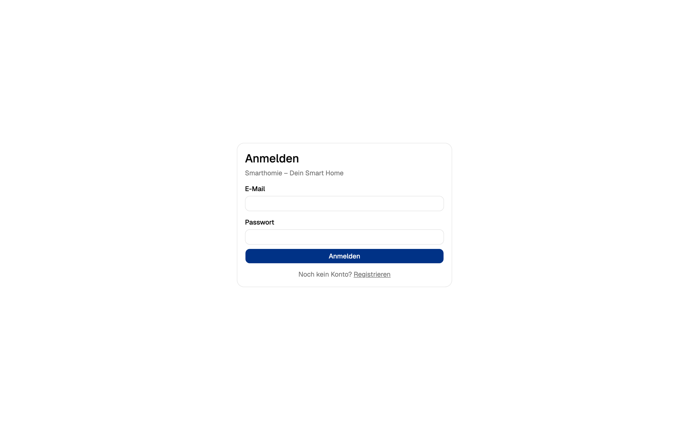

Auf der Anmeldeseite geben bestehende Nutzer ihre E-Mail-Adresse und ihr Passwort ein. Über den Link **Registrieren** gelangt man zur Konto-Erstellung. Diese Seite ist die einzige öffentlich zugängliche Ansicht — alle weiteren Bildschirme erfordern eine gültige Anmeldung.

### Registrierung

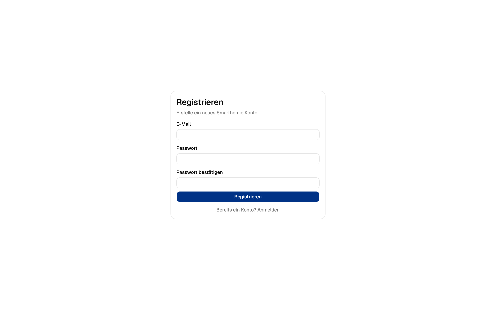

Neue Nutzer erstellen hier ein Konto. Das Passwort wird im Backend mit BCrypt gehasht (NFR-02) und niemals im Klartext gespeichert. Der erste angelegte Benutzer ist automatisch Owner; weitere Personen werden über die Mitgliederverwaltung eingeladen.

### Dashboard

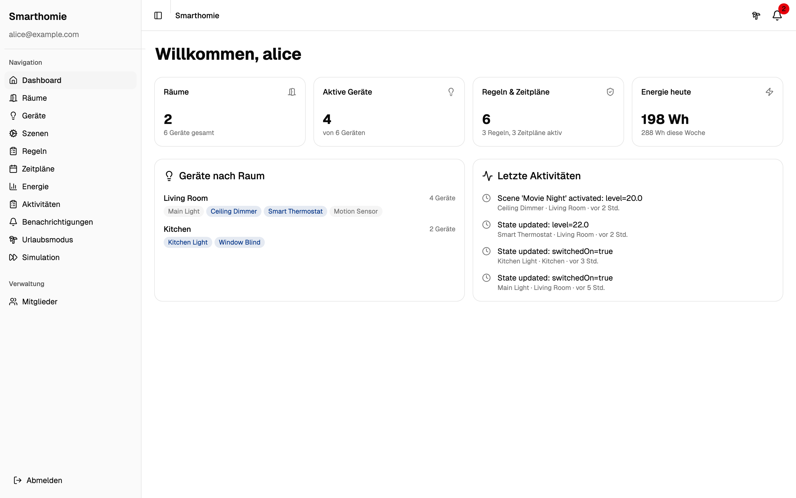

Das Dashboard ist die Startseite nach dem Login. Es zeigt auf einen Blick die wichtigsten Kennzahlen: Anzahl der Räume und Geräte, aktive Regeln und Zeitpläne sowie den aktuellen Energieverbrauch. Im unteren Bereich werden die Geräte je Raum aufgelistet und die letzten Aktivitäten chronologisch eingeblendet.

### Räume

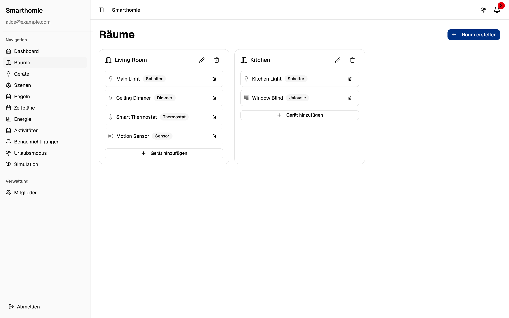

In der Raumverwaltung legen Owner neue Räume an, benennen bestehende um oder entfernen sie. Räume sind die organisatorische Klammer für Geräte — jedes Gerät gehört zu genau einem Raum.

### Geräte

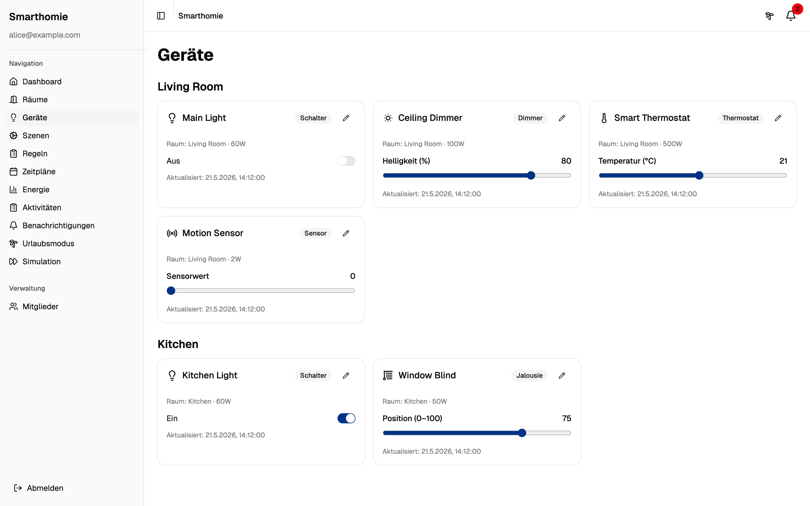

Hier werden alle Geräte nach Raum gruppiert angezeigt. Jede Gerätekarte zeigt Typ (Schalter, Dimmer, Thermostat, Sensor, Jalousie), Leistungsaufnahme und den aktuellen Zustand. Geräte lassen sich direkt aus dieser Ansicht schalten oder regeln — die Änderung wird in Echtzeit per WebSocket an alle verbundenen Clients gepusht.

### Szenen

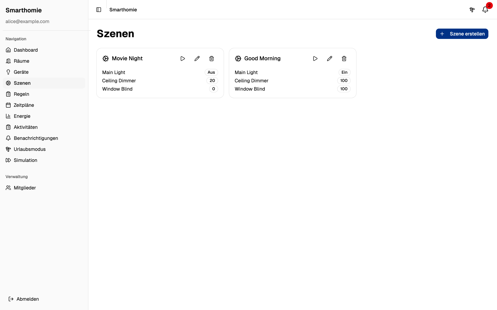

Szenen bündeln mehrere Gerätezustände unter einem Namen, zum Beispiel *"Filmabend"* mit gedimmtem Licht und heruntergefahrenen Jalousien. Mit einem Klick werden alle in der Szene definierten Zustände gleichzeitig gesetzt.

### Regeln

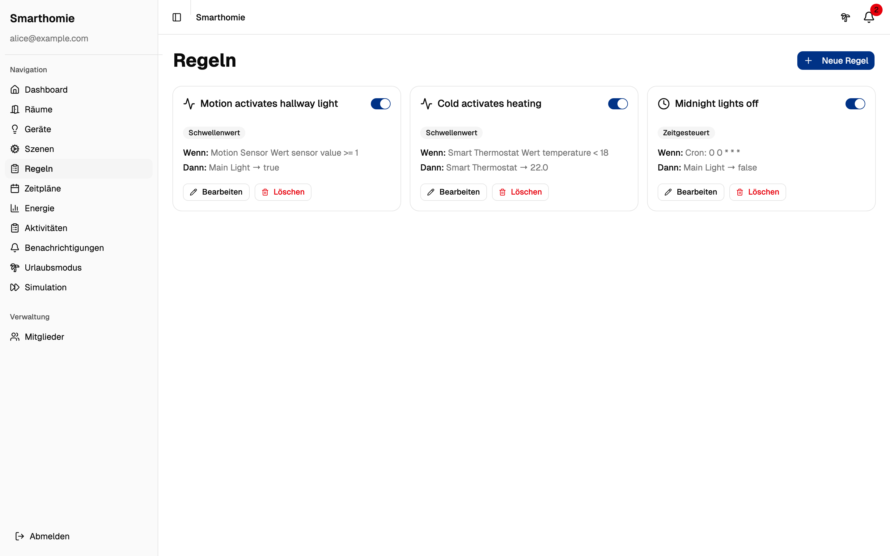

Regeln folgen dem IF-THEN-Schema: Ein Trigger (Ereignis oder Schwellwert eines Sensors) löst eine Aktion an einem Zielgerät aus. Beispiel: *"Wenn Temperatursensor < 18 °C, dann Heizung auf 22 °C"*. Die Regel-Engine wird über jeden Geräte-State-Update geprüft.

### Zeitpläne

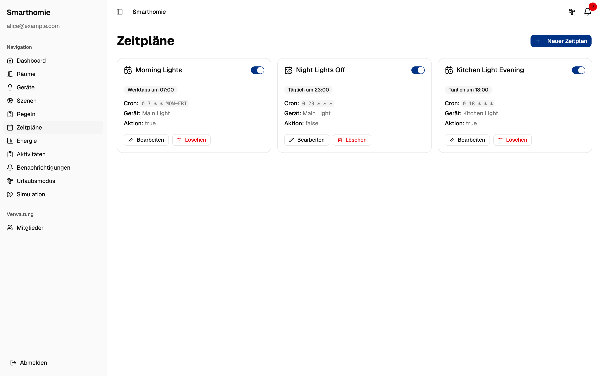

Zeitpläne führen Aktionen zu festen Uhrzeiten oder wiederkehrend aus. Sie eignen sich für unbedingte Routinen wie *"Jeden Tag um 22:00 alle Lichter aus"*. Konflikte mit anderen Plänen oder Regeln werden über die integrierte Konflikterkennung gemeldet.

### Energie

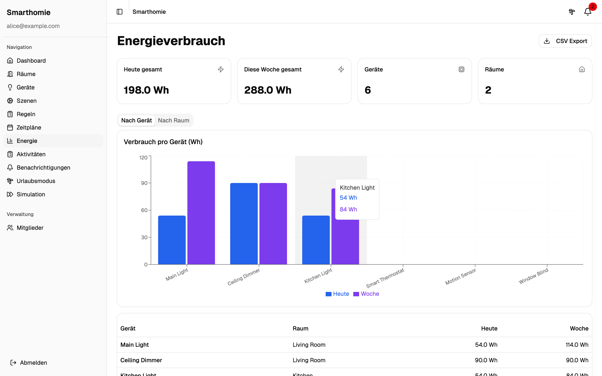

Das Energie-Dashboard aggregiert den Stromverbrauch pro Gerät, Raum und Haushalt — wahlweise für Tag, Woche oder Monat. Die Daten lassen sich als CSV exportieren (FR-16). Diagramme visualisieren die Verteilung und Spitzenzeiten.

### Aktivitäten

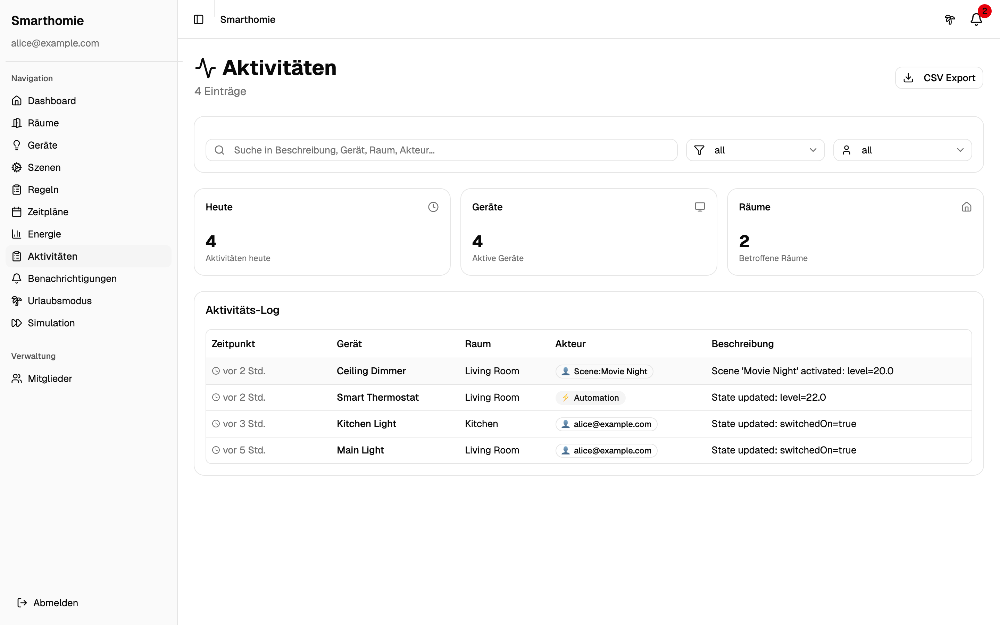

Das Aktivitätsprotokoll listet jede Zustandsänderung mit Zeitstempel, beteiligtem Gerät und dem Auslöser auf — sei es ein Benutzer, ein Zeitplan oder die Regel-Engine. Auch dieser Verlauf kann als CSV exportiert werden.

### Benachrichtigungen

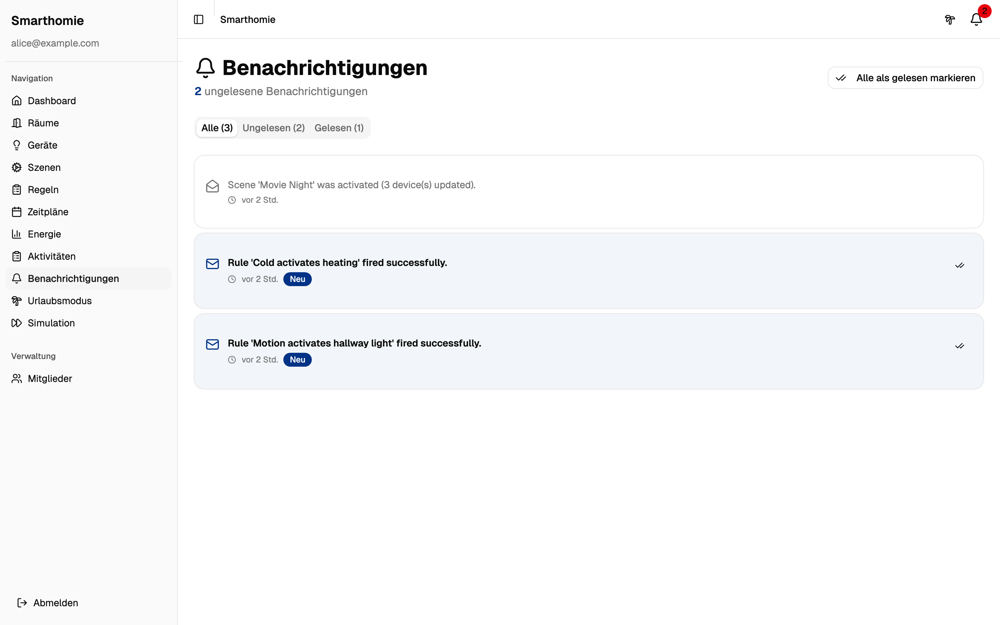

Hier landen In-App-Meldungen, etwa wenn eine Regel ausgelöst hat oder ein Zeitplan fehlgeschlagen ist. Ungelesene Benachrichtigungen werden im Glocken-Icon oben rechts mit einem roten Punkt markiert.

### Urlaubsmodus

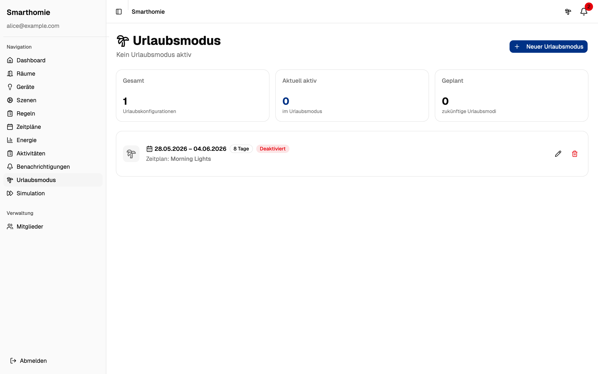

Der Urlaubsmodus aktiviert einen alternativen Zeitplan für einen festgelegten Zeitraum — zum Beispiel, um die Lichter unregelmäßig schalten zu lassen, damit das Haus bewohnt wirkt. Reguläre Zeitpläne werden während dieser Zeit übersteuert.

### Mitglieder

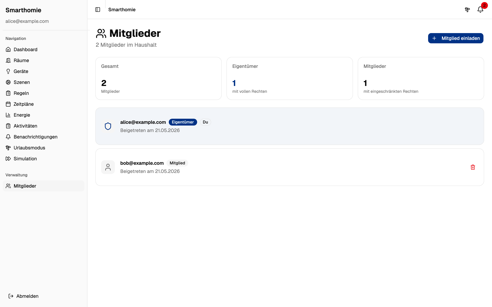

Owner laden weitere Personen per E-Mail-Adresse als Member zu ihrem Haushalt ein. Member können Geräte bedienen, aber keine Verwaltungsoperationen durchführen. Bestehende Zugänge können widerrufen werden.

### Simulation

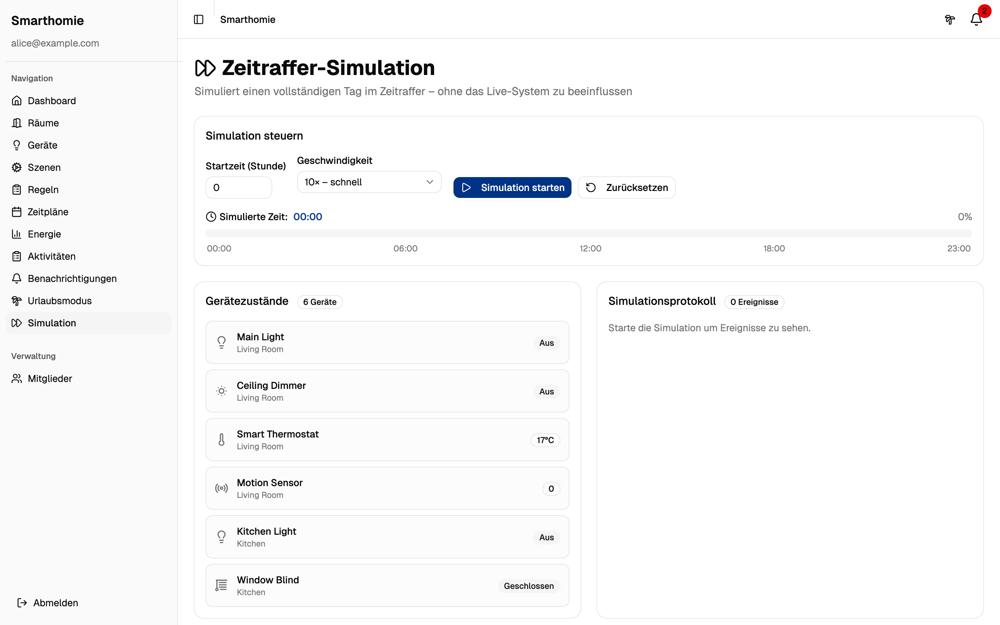

Die Simulation spielt einen kompletten Tag im Zeitraffer durch, ohne das echte System zu beeinflussen. Damit lassen sich Regeln und Zeitpläne risikofrei testen, bevor sie produktiv geschaltet werden.

## Szenarien

### Szenario 1: Neues Gerät einrichten

1. Als Owner anmelden.
2. Raum auswählen oder neu anlegen.
3. Neues Gerät hinzufügen und Namen vergeben.
4. Gerät direkt testen, indem der Zustand geändert wird.

### Szenario 2: Automatische Abendbeleuchtung

1. Zeitplan für eine Lampe erstellen.
2. Startzeit (z. B. täglich 18:00) und Aktion definieren.
3. Zeitplan aktivieren.
4. Anwendung schaltet das Gerät zur geplanten Zeit automatisch.

### Szenario 3: Urlaubsmodus aktivieren

1. Zeitraum für den Urlaub festlegen.
2. Ersatz-Zeitplan auswählen.
3. Urlaubsmodus aktivieren.
4. Normale Zeitpläne werden während des Zeitraums übersteuert.

## Bekannte Einschränkungen

- Die Anwendung ist auf lokale Entwicklung und Lehrprojekt-Einsatz ausgelegt.
- Bei Neustart im Dev-Setup kann die Datenbank neu initialisiert werden (abhängig von der Konfiguration).
- Zugriffskontrolle basiert auf Rollen; eine vollständige produktive Authentifizierungslösung ist nicht Teil dieses Stands.

## FAQ

### Wie starte ich die Anwendung am schnellsten?

Mit docker compose up --build im Repository-Root.

### Welche Rolle sollte ich verwenden?

Owner für Verwaltung und Konfiguration, Member für normale Bedienung.

### Warum sehe ich meine erstellten Daten nach einem Neustart nicht mehr?

Im Entwicklungsmodus kann die Datenbank bei Neustart neu erstellt werden.

### Wo finde ich API-Details?

Die JavaDoc wird lokal mit `mvn javadoc:javadoc` (im `backend/`-Verzeichnis) generiert und liegt anschließend unter `backend/target/site/apidocs/index.html`.

